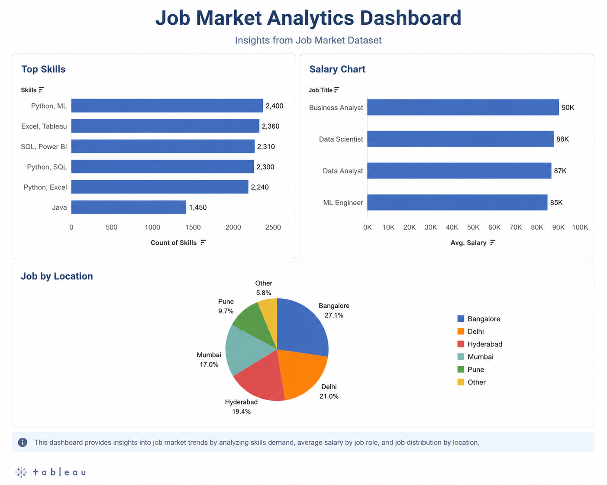
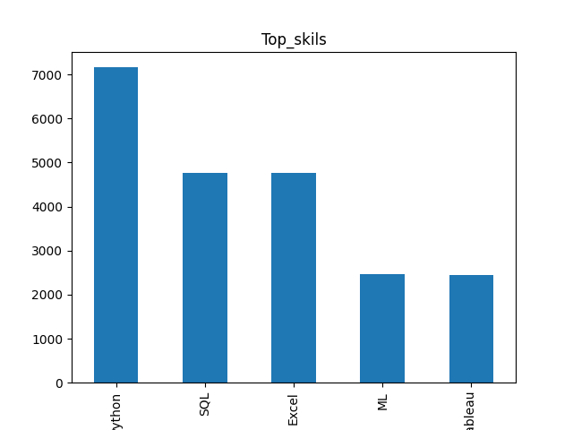
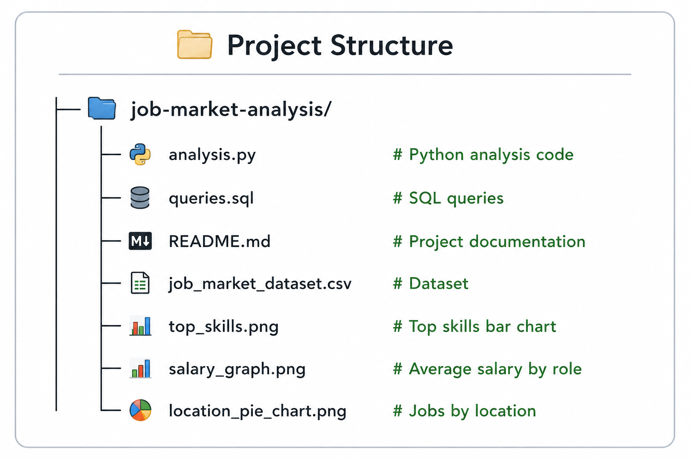

# Job Market Analytics Dashboard

## Project Overview
This project analyzes a dataset of 12,000+ job records to identify:
- Top in-demand skills
- Salary trends
- Hiring locations
- Job role distribution

The project was built using Python, SQL, Pandas, and Matplotlib for data analysis and visualization.

---
## Tableau Dashboard

## Tools & Technologies
- Python
- Pandas
- SQL
- Matplotlib
- tableau

---

## Dataset
The dataset contains:
- Job Title
- Company
- Location
- Salary
- Skills

Total Records: 12,000+

---

## Python Analysis Performed
- Data loading using pandas
- Skills analysis using split() and value_counts()
- Salary analysis using groupby() and mean()
- Hiring location analysis
- Data visualization using bar charts and pie charts

---

## SQL Analysis
The following SQL operations were performed:
- GROUP BY
- COUNT()
- AVG()
- ORDER BY

SQL was used to analyze:
- Top job roles
- Average salary by role
- Hiring trends by location
- Skills demand

---
## Visualizations

### Top Skills

### Salary Analysis

### Jobs by Location

---

## Key Insights
- Python and SQL were the most demanded skills
- Bangalore and Delhi showed high hiring activity
- ML Engineer and Data Scientist roles had higher average salaries

---

## Project Structure

---

## Conclusion
This project demonstrates practical skills in:
- Data Analysis
- SQL Querying
- Data Visualization
- Exploratory Data Analysis
- Python Programming

